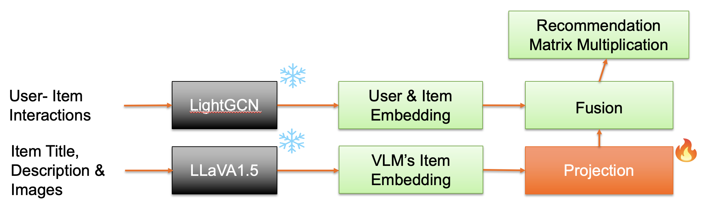

# HyperRec


*Figure: High-level architecture of the multimodal recommendation system. The framework integrates Vision-Language Model (VLM) embeddings with Graph Neural Network (GNN) representations through a learnable fusion mechanism.*
# Multimodal Recommendation via VLM & GNN Fusion

This repository implements a multimodal recommendation system that fuses Vision-Language Model (VLM) embeddings with Graph Neural Network (GNN) representations for enhanced recommendation performance. The pipeline is divided into the following stages:

## 1. Hyperparameter Search
The hyperparameter search is conducted using `LIGHTGCN_HYPERPARAM_TUNING.PY`. This script leverages [Weights & Biases (wandb)](https://wandb.ai/) for efficient hyperparameter optimization. It explores various configurations of LightGCN, including embedding dimensions, number of layers, learning rates, and regularization weights.

### Key Features:
- Bayesian optimization for hyperparameter tuning.
- Validation metrics include Recall@K and NDCG@K.
- Automatic logging of results to wandb.

## 2. LightGCN Training
The LightGCN model is trained using `LIGHTGCN_FINAL_TRAINING.PY`. This script trains the model on user-item interaction data using a BPR loss function and evaluates it on validation and test sets.

### Key Features:
- Implements BPR loss for implicit feedback data.
- Tracks Recall@K and NDCG@K during training.
- Saves the best-performing models based on validation metrics.

## 3. Inference
The inference process is handled by `LIGHTGCN_INFER.PY`. This script loads a pre-trained LightGCN model and generates top-K recommendations for a given user.

### Key Features:
- Supports loading trained models and encoders.
- Efficient computation of user-item scores.
- Outputs top-K recommendations with scores.

## 4. Generic VLM Embedding Extraction
The `GENERIC_VLM_EMBEDDING.PY` script extracts item embeddings using Vision-Language Models (e.g., LLaVA, SmolVLM). These embeddings are used to incorporate multimodal information into the recommendation system.

### Key Features:
- Supports multiple VLMs for embedding extraction.
- Processes item metadata and images to generate embeddings.
- Saves embeddings in a format compatible with downstream tasks.

## 5. HyperRec: Multimodal Fusion Training
The `HYPERREC.PY` script fuses LightGCN embeddings with VLM embeddings using a learnable fusion mechanism. This enables the recommendation system to leverage both graph-based and multimodal information.

### Key Features:
- Implements a fusion layer to combine LightGCN and VLM embeddings.
- Uses a learnable parameter `alpha` to balance the contributions of each modality.
- Tracks performance metrics during training and saves the best models.

## Getting Started
1. Clone the repository:
    ```bash
    git clone https://github.com/your-repo/HyperRec.git
    cd HyperRec
    ```

2. Install dependencies:
    ```bash
    pip install -r requirements.txt
    ```

3. Follow the pipeline:
    - Run hyperparameter search: 
    ```bash 
    python lightGCN_hyperparam_tuning.py
    ```
    - Train LightGCN: 
    ```bash 
    python lightGCN_final_training.py
    ```

    - Perform inference: 
    ```bash 
    lightGCN_infer.py
    ```
    
    - Extract VLM embeddings: 
     ```bash 
    python gneric_vlm_embedding.py
    ```
    
    - Train HyperRec: 
    ```bash 
    python hyperRec.py
    ```
## Key Project Results
The following table summarizes the performance improvements achieved by the proposed multimodal recommendation system:

| Model                  | Recall@10 | NDCG@10  |
|------------------------|-----------|---------|
| LightGCN (Baseline)    | 0.04097 | 0.02497 | 
| LightGCN + VLM Fusion  | 0.0175     | 0.007   |

*Figure: Performance comparison between LightGCN and the proposed multimodal fusion approach.*

## References and Acknowledgments
This work leverages the following resources and tools:
- [Weights & Biases (wandb)](https://wandb.ai/) for hyperparameter optimization.
- [LLaVA 1.5](https://github.com/haotian-liu/LLaVA)
-[SmolVLM2-2.2B-Instruct](https://huggingface.co/HuggingFaceTB/SmolVLM2-2.2B-Instruct)
- [LightGCN](https://arxiv.org/abs/2002.02126)

## License
Copyright 2025 Sarthak Kaushal

Licensed under the Apache License, Version 2.0 (the "License");
you may not use this file except in compliance with the License.
You may obtain a copy of the License at

  http://www.apache.org/licenses/LICENSE-2.0

Unless required by applicable law or agreed to in writing, software
distributed under the License is distributed on an "AS IS" BASIS,
WITHOUT WARRANTIES OR CONDITIONS OF ANY KIND, either express or implied.
See the License for the specific language governing permissions and
limitations under the License.

